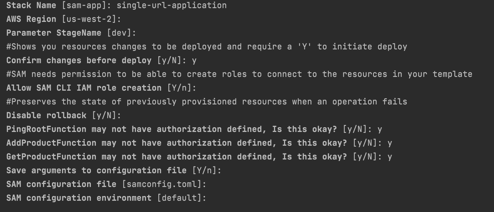
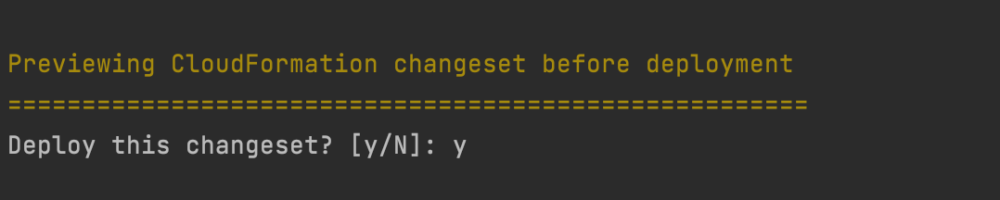
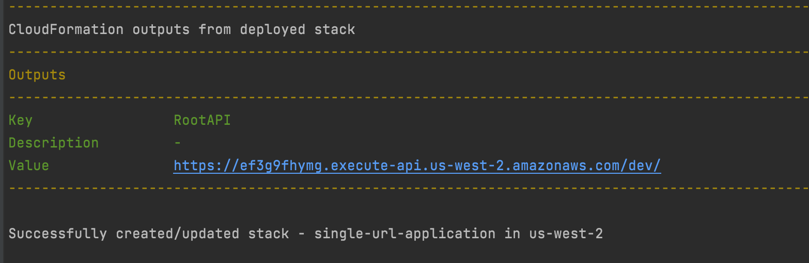
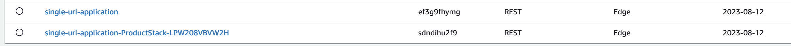
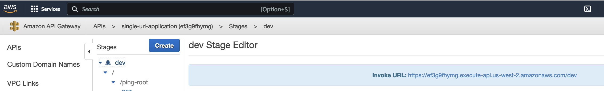
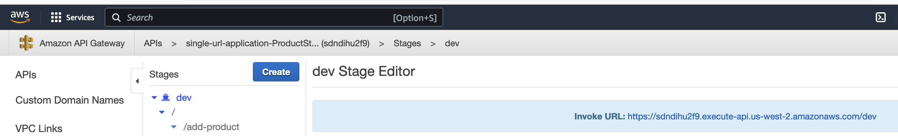

When we build a big application, we have to consider limitation of making cloudformation resources in a single template. So we need to split our application into multiple templates. But there is a problem. When we create separate stacks, it creates separate URL to access APIs of those stacks. If you want to integrate all these different URLs, you may have to handle complex mechanism. But if you got a solution that will give you a single URL to access all your stacks, how about then!!

Here in this post, I will show you how to create a parent API gateway and then access child stacks' API gateway using a single endpoint. 

### Installation
- First you have to install aws sam cli into your machine. 
- Then configure aws cli.

**If you don't have CLI installed and configured into your local machine please follow prerequisite steps from this** [link](https://medium.com/@farzanajuthi08/how-to-make-an-application-using-serverless-application-model-sam-and-python-937415d38a44)

### Local Development

- After installation done, you have to pull the code from git repository [(HTTPS link)](https://github.com/farzana-juthi/sam-nested-stack.git)
- Then go to project directory by using following command:
  ```
    cd <your folder name>
    example: cd sam-nested-stack
  ```

- Then open terminal in root folder of this project and run following command:
  ```
    sam build
  ```
- If you deploy first time, then you have to run following command:
  ```
    sam deploy --guided --capabilities CAPABILITY_IAM CAPABILITY_AUTO_EXPAND
  ```
  If you want to run this command with your predefined profile then command will be 
  ```
    sam deploy --guided --profile <your_profile_name_without_this_bracket> --capabilities CAPABILITY_IAM CAPABILITY_AUTO_EXPAND
  ```
- After running previous command, you will see that you have to set a stack name. Please give a unique stack name. 

  - Here I gave my application name "single-url-application". You can give your own application name here. After successful deployment you will see this name in cloudformation stack list. You can choose your own region and StageName and you can keep other options as shown in following image. After pressing "enter" button you will find option one after one.
  
    
  
  - Then you will get following option like image
    
    
  
- After successful deployment you will get following output. This is your single URL. You can access all other APIs of other stacks through this URL:
  
    

- After one sucessful deployement, if you want to change anything, then you need to build it first and run only deploy command like following:
  ```
    sam build
    sam deploy
  ```

Lets see API gateway from aws console. First image shows that both parent and child stacks are created. Second image shows the parent stack URL and third image shows child stack URL.
  
   
   
   

   

- Now we will see how we access the child stack APIs through parent API endpoint. You will see that I used parent API url, then the child stack proxy part "product" and then the child stack method part.

  - If you want to use web browser to check this, you can only check GET method because browser automatically send get request. If you want to check this with carl or postman you can do that.
  
  - From Browser, you can check your GET APIs like following
   
    ```
      https://ef3g9fhymg.execute-api.us-west-2.amazonaws.com/dev/product/get-product/1
    ```
    
  - If you want to check POST method, you can check this like following:
  
    ```
       curl -X POST  <API URL> -d <request body>

       Example: curl -X POST  https://ef3g9fhymg.execute-api.us-west-2.amazonaws.com/dev/product/add-product -d {}
    ```
    
    **GET API using carl**
    
    ```
       curl -X GET  https://ef3g9fhymg.execute-api.us-west-2.amazonaws.com/dev/product/get-product/1
    ```